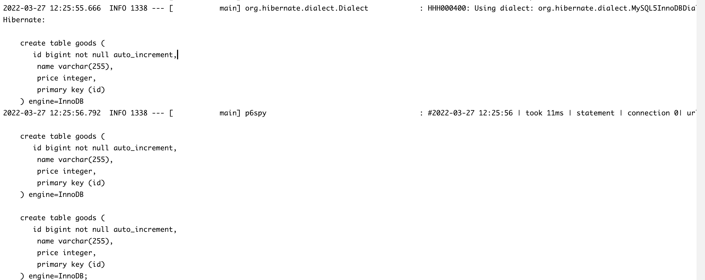
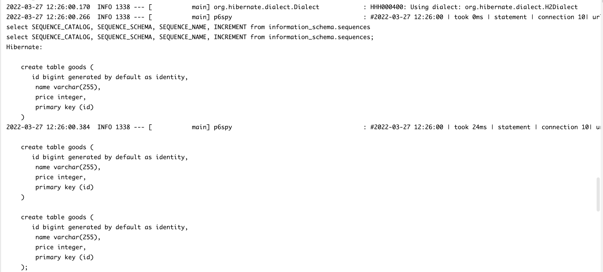

# p6spy-starter-samples

    p6spy starter samples.
    
    
## spring-data-jpa-sample

### 说明
    
    mysql配置为 application-mysql.yml
        需调整数据库配置（账号密码及库名），无需创建表
        
    h2配置为 application-h2.yml
        当前激活配置文件
    
    spy.properties 为p6spy配置文件

### 效果截图

+ mysql

   

+ h2

    
    